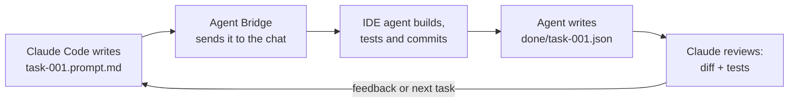

# Agent Bridge

Let Claude Code, scripts or any AI agent hand tasks to your Antigravity / VS Code AI chat, and know when they're done.

[](https://open-vsx.org/extension/alokkkchaudharyyy/agent-bridge)
[](https://github.com/alokkkchaudharyyy/agent-bridge/releases)
[](LICENSE)

<!-- TODO: record media/demo.gif, then add:  -->

You drop a Markdown file into `.agent-inbox/` and Agent Bridge types it into your IDE's agent chat. When the agent finishes, it writes a small "done" file back, so whoever sent the task knows it's finished. Agent Bridge never runs commands itself. It only sends text to the chat.

## Install in 1 minute

**From Open VSX:** in Antigravity (or VSCodium / Cursor), open the Extensions panel, search **Agent Bridge**, and click Install.

**From a .vsix file:** download the latest `agent-bridge-x.y.z.vsix` from [Releases](https://github.com/alokkkchaudharyyy/agent-bridge/releases). Then go to Extensions → `⋯` → **Install from VSIX…** and pick the file.

Then reload the window (Command Palette → **Developer: Reload Window**). You should see **Agent Bridge: watching** in the status bar.

## Try it yourself in 30 seconds

1. Open your project folder. Click **Add** when Agent Bridge offers to add `.agent-inbox/` to `.gitignore`.
2. Create `.agent-inbox/prompt.md` containing `Say hello`.
3. Within a few seconds Agent Bridge asks whether to send it. Click **Send**.
4. Watch "Say hello" appear in the agent chat. The file moves to `.agent-inbox/archive/`.

## Let Claude Code (or any agent) drive it

Paste the prompt below **once** into Claude Code, Codex, Gemini CLI or any agent that can read and write files. Replace `{PROJECT_PATH}` with your project folder first. After that, the agent knows how to hand tasks to your IDE agent and wait for the results.

````text
You are the orchestrator for this project. You plan tasks, hand them to the IDE agent
(Antigravity / VS Code chat) through the Agent Bridge extension, then review its work.

PROJECT: {PROJECT_PATH}
INBOX:   {PROJECT_PATH}/.agent-inbox

SENDING A TASK
- Pick a task id: letters, digits, . _ - (max 64), e.g. task-001, task-002.
- Write the prompt as Markdown. First lines:
    <!-- new-conversation -->   (optional: start a fresh agent chat; use it for unrelated tasks)
    <!-- id: task-001 -->
  then the task itself: goal, files involved, acceptance criteria, "run the tests", "commit when done".
- Save it as INBOX/task-001.tmp, then rename it to INBOX/task-001.prompt.md.
  (Files named *.prompt.md are sent one at a time in name order; prompt.md is sent first.
  The rename makes sure a half-written file is never sent.)
- Never write into INBOX/archive/, INBOX/done/ or INBOX/sent/.
- If you didn't set an id, find it in INBOX/sent/ (newest file) or the last "id=" in INBOX/bridge.log.

WAITING (never guess with fixed sleeps)
- INBOX/sent/<id>.json appears when the prompt has actually been sent. A human may need to click
  "Send" first.
- The task is over when INBOX/done/<id>.json or INBOX/question/<id>.md appears. Wait for that:

  bash:
    ID=task-001; INBOX="{PROJECT_PATH}/.agent-inbox"
    until [ -f "$INBOX/done/$ID.json" ] || [ -f "$INBOX/question/$ID.md" ]; do sleep 15; done

  PowerShell:
    $id = 'task-001'; $inbox = '{PROJECT_PATH}\.agent-inbox'
    while (-not (Test-Path "$inbox\done\$id.json") -and -not (Test-Path "$inbox\question\$id.md")) { Start-Sleep 15 }

  If your shell tool has a time limit, run the loop in the background or re-run it until a file appears.

AFTER IT FINISHES
- done/<id>.json looks like {"id","status":"done"|"failed"|"blocked","summary","commits":[...]}.
- question/<id>.md means the agent needs a decision. Answer it in a new prompt (you may reuse the id).
- Review the work yourself: git log / git diff for the listed commits, run the tests, check the
  acceptance criteria. Don't trust the summary alone.
- Then send the next prompt: your feedback (what to fix) and/or the next task.

LESSONS (so the IDE agent learns from reviews)
- When you find a real mistake that could happen again, append one line to
  {PROJECT_PATH}/AGENT_LESSONS.md:
    - YYYY-MM-DD · area: mistake → rule
- One concrete rule per mistake, no duplicates, keep it under ~50 lines. Agent Bridge reminds the
  IDE agent to read this file on every prompt.

SAFETY
- Never put secrets (API keys, passwords, tokens) in prompts or in the inbox.
- Leave Agent Bridge's "confirm before send" setting on unless the user says this project is trusted.
- Only send tasks the user asked for.
````

The full file format (ids, receipts, done/question files, hook variables) is in [PROTOCOL.md](PROTOCOL.md).

## Example workflow



## Commands

| Command | What it does |
| --- | --- |
| `Agent Bridge: Send current file as prompt` | Sends the open file to the agent chat right away (no confirmation). |
| `Agent Bridge: Pause/Resume` | Stops or restarts sending from the inbox. Done/question files are still watched. |
| `Agent Bridge: Open log` | Opens `.agent-inbox/bridge.log`. Clicking the status bar does the same. |
| `Agent Bridge: Add lesson` | Asks for area, mistake and rule, then appends a line to `AGENT_LESSONS.md`. |

## Settings

| Setting | Default | What it does |
| --- | --- | --- |
| `agentBridge.inboxPath` | `""` | Folder to watch. Empty = `<workspace>/.agent-inbox`. Relative paths start at the first workspace folder. |
| `agentBridge.pollIntervalMs` | `4000` | How often to check the inbox, in ms (minimum 1000). |
| `agentBridge.confirmBeforeSend` | `true` | Ask before sending each prompt. **Keep this on** unless you trust everything that can write to the inbox. |
| `agentBridge.newConversationMarker` | `<!-- new-conversation -->` | A prompt starting with this opens a new agent chat first. Empty = off. |
| `agentBridge.completionSignal` | `true` | Ask the agent to write `done/<id>.json` or `question/<id>.md` when it finishes. |
| `agentBridge.stuckAfterMinutes` | `30` | Warn if nothing comes back within this many minutes. 0 = never. |
| `agentBridge.lessonsFile` | `AGENT_LESSONS.md` | Where review lessons live (relative to the workspace, or absolute). |
| `agentBridge.lessonsMode` | `reference` | `reference`: remind the agent to read the file. `inline`: paste the newest lessons. `off`: nothing. |
| `agentBridge.onDoneCommand` | `""` | Optional shell command run on done / question / stuck. User settings only. See [PROTOCOL.md](PROTOCOL.md#ondonecommand-env-vars). |

## Troubleshooting

- **Nothing arrives in the chat.** Open the log (click the status bar) and read the last lines. Check that the file is named exactly `prompt.md` or ends in `.prompt.md`, sits directly in `.agent-inbox/`, and that the status bar doesn't say *paused*. Files changed in the last ~1.5 s are skipped until writing stops. Still stuck? Run **Developer: Reload Window**.
- **Two IDE windows on the same folder.** Both windows watch the same inbox and may race for the same file. Keep one window open per folder, or pause Agent Bridge in the other one.
- **Plain VS Code, Cursor and others.** The Antigravity command doesn't exist there, so Agent Bridge falls back to VS Code's chat (`workbench.action.chat.open`). Some versions only prefill the chat box, so you press Enter. If no chat exists at all, you get one "no supported agent chat found" error, and the prompt stays in `archive/`.
- **"may be stuck" warning.** The agent didn't write a done or question file in time. Check the chat. It may still be working, or it may have forgotten the last step.

## Safety

> Anything that can write to the inbox can talk to your agent. **Don't turn off `confirmBeforeSend`** while your agent may auto-run terminal commands, especially in folders others can write to (shared drives, synced folders, CI). Keep the inbox out of git (the `.gitignore` offer does this) and never put secrets in prompts.
>
> `onDoneCommand` is the only thing Agent Bridge runs itself. It is read only from your user settings (never from a workspace), gets task details only through environment variables, and is disabled in untrusted workspaces. Treat `AGENT_BRIDGE_SUMMARY` as untrusted text.

## Known limits

- Antigravity support relies on the internal command `antigravity.sendPromptToAgentPanel`. It isn't a public API and may change in an update.
- The done/question signal depends on the agent following the footer instructions. Most do, but not always. That's what the stuck warning is for.
- Multi-root workspaces use the first folder. The inbox is polled (every 4 s by default), not watched instantly.

## Contributing & license

See [CONTRIBUTING.md](CONTRIBUTING.md). MIT licensed, see [LICENSE](LICENSE).
